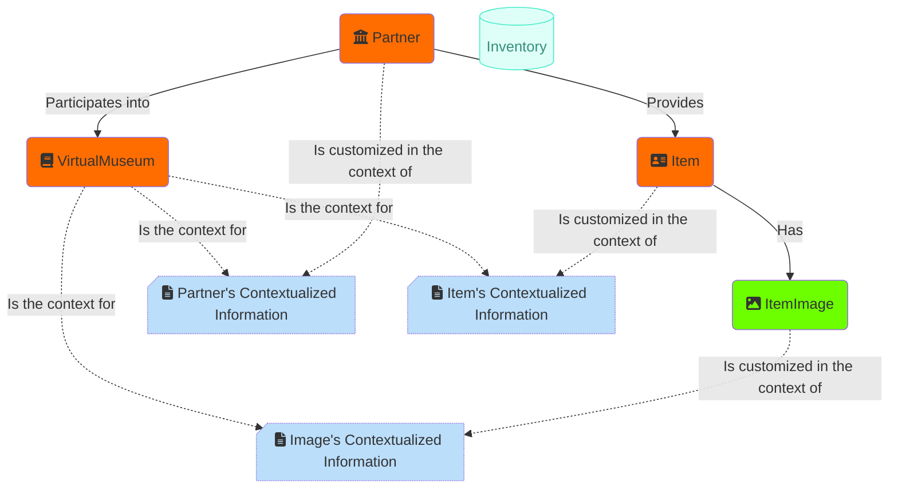

# virtual-museum-inventory
Inventory of a Virtual-Museum. Stores, organizes and gives access to the Items in the Virtual Museum

# Development

## VirtualMuseum Controller
[/VirtualMuseum](/VirtualMuseum)

## OpenApi Documentation
[/openapi/v1.json](/openapi/v1.json)

## Swagger UI for OpenApi Documentation
[/swagger/index.html](/swagger/index.html)

# Databases

## The inventory

The `Inventory` database is the lowest layer, sustaining all others.
Its primary roles is to store the data about **Virtual Museums** (the contexts), **Partners** (the museums), the **Items** (the objects or monulentd of the partners that are displayed in the Virtual Museums) and their **Images** (different photos of the item) and **Details** (a closer look on a remarquable part of the item) 

The Inventory does NOT store any information related to the business logic of individual applications.

The objective is to provide an unique and central repository, and API to maintain, and query the Inventory; providing the required basic features to any *museum* type of application. Such application will likely rely on the inventory, but will implement their own business logic.

## The collections

Different type of collections exist:
- *Museum*
- *Gallery*
- *Exhibition*
 
A **Museum**, is a Virtual Museum that presents all the *Items* and all the *Partners* defined in that Virtual Museum.

Examples: Discover Islamic Art, Discover Baroque Art, Sharing History

A **Gallery**, is a Virtual Museum that presents one collection of selected *Items*. Optionally offering a contextualized version of the items' metadata.

Examples: Carpet Art, Glass Art

An **Exhibition**, is a Virtual Museum that presents one collection of selected *Images* (Images of an Item). Optionally offering a contextualized version of the images' metadata.

Examples: The use of Colours in Art

---

In a nutshell:
- **Museum** = **All items** and all partners of the Virtual Museum
- **Gallery** = **Selected items** and partners, chosen amongst the entire inventory, and presented in one specific context
- **Exhibition** = An extension of Gallery, where the only **selected images** are presented. Such images are optionally organized in *Themes*

---

